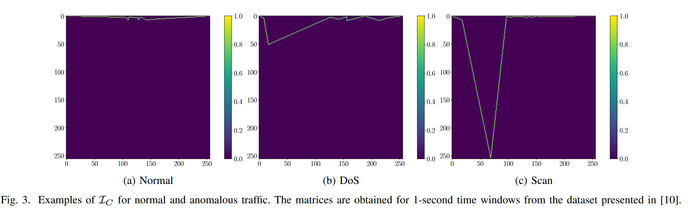

# Unsupervised Network Anomaly Detection with Autoencoders and Traffic Images (EUSIPCO 2025)

Official repository to the article "Unsupervised Network Anomaly Detection with Autoencoders and Traffic Images" accepted for publication in European Signal Processing Conference (EUSIPCO) 2025.




## Preprocessed dataset

The link for downloading the dataset will be available soon.

## Instructions

Download the preprocessed dataset (UGR'16) and then run the script training.py for fitting the CNN. Then, run test.py (or test_multiple_pda.py if you want to test with different thresholds).

## Authors

Michael Neri*, Sara Baldoni°

*Faculty of Information Technology and Communication Sciences, Tampere University, Tampere, Finland

°Department of Information Engineering, University of Padova, Padua, Italy 

## Reference

If you use parts of this repository please cite the following work:

```
@INPROCEEDINGS{Neri_EUSIPCO_AD_2025,
  author={Neri, M. and Baldoni, S.},
  booktitle={European Signal Processing Conference (EUSIPCO)}, 
  title={{Unsupervised Network Anomaly Detection with Autoencoders and Traffic Images}}, 
  year={2025},
  volume={},
  number={},
  pages={},
  doi= {}}
```
